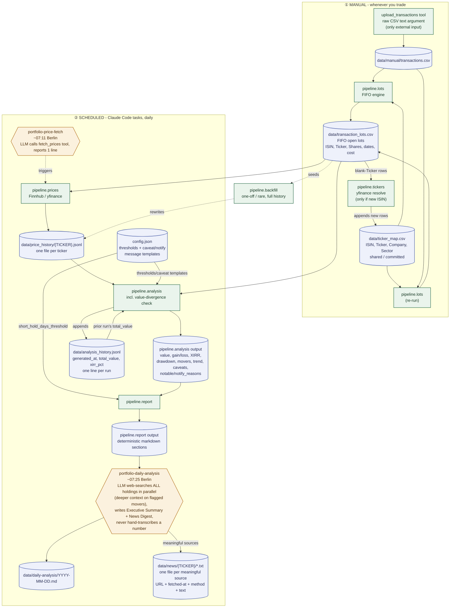

# Architecture

What this system is and how data moves through it. Not a rules/gotchas doc
(see [`AGENT_NOTES.md`](AGENT_NOTES.md) for that) and not a setup guide (see
[`SETUP.md`](SETUP.md)) - this is the objective "how it works" reference.

## Deployment model

This is **not** a project-scoped tool. `bootstrap.sh` (repo root) registers
the `portfolio` MCP server and the Claude Skill **globally**
(`claude mcp add --scope user`, plus copying `skills/portfolio/` to
`~/.claude/skills/portfolio/`) - the server is a single long-running HTTP
process (`portfolio_tools/server.py`, `mcp.run(transport="streamable-http")`,
bound to `127.0.0.1` only) that every Claude Code session on the machine
talks to, in every project, not just this repo. There is no
`${CLAUDE_PROJECT_DIR}`-relative anything in this codebase - every path is
computed from `portfolio_tools/paths.py`'s `PACKAGE_ROOT =
Path(__file__).resolve().parent`, i.e. relative to wherever this package's
own source happens to live on disk, never from cwd or "the current project."
**Concretely: if you're working in some unrelated project and the `portfolio`
MCP tools are available, they still operate on this one repo's data** - that
is by design, not a bug.

Because it's one shared server reachable from potentially-concurrent
sessions/projects, `portfolio_tools/server.py` wraps **every** tool call in a
single `fcntl.flock`-based lock (`portfolio_tools/lock.py`, `data/.pipeline.lock`)
before it touches anything under `data/` - a single global lock beats
per-file locks here because several tools (e.g. `compute_lots`) touch more
than one file, and per-file locking would leave a gap between them.

There's no file-upload path assumed between whoever's talking to the server
and wherever the server is running (could be a different machine entirely,
in principle) - `transactions.csv` arrives via the `upload_transactions` tool
(raw CSV text as a string argument), not by the user placing a file at a
path. `portfolio_tools/pipeline/uploads.py` validates the header against the
expected Scalable Capital column set before saving (rejects garbage rather
than silently accepting a wrong-format paste), and keeps one `.bak` of
whatever was there before.

**The Claude Skill is intentionally not under `.claude/` in this repo** - it
lives at `skills/portfolio/` instead, so Claude Code doesn't auto-discover it
as a *project-scoped* skill while you're developing here. The skill is meant
to be reached only through its **global** install
(`~/.claude/skills/portfolio/`, deployed by `bootstrap.sh`), the same way any
other project would see it - keeping it out of `.claude/` avoids a second,
project-scoped copy silently coexisting with (and potentially drifting from)
the global one.

## Code layout

One package, no code outside it - `mcp_servers/portfolio_tools/`. The pipeline
is a subpackage of the server, not a sibling project:

```
skills/portfolio/           <- the Claude Skill source (see docs/AGENT_NOTES.md
                                for why it's not under .claude/); bootstrap.sh
                                copies it to ~/.claude/skills/portfolio/
docs/                        <- this directory: architecture, agent-dev rules,
                                human setup/quickstart guides
mcp_servers/
  portfolio_tools/             <- the whole distributable unit
    server.py                    FastMCP server, HTTP-only, the locking wrapper
    lock.py                      fcntl.flock-based cross-request/cross-process lock
    paths.py                     PACKAGE_ROOT/DATA_DIR/CONFIG_FILE/ENV_FILE - single source of truth
    config.json, .env            config/secrets, not data
    pipeline/                    the deterministic computation
      lots.py, tickers.py, prices.py, backfill.py, analysis.py, report.py, config.py, uploads.py
    data/                        internal default location - see "Deployment model" above
      manual/transactions.csv, ticker_map.csv, transaction_lots.csv,
      price_history/*.jsonl, analysis_history.jsonl, news/, daily-analysis/
    requirements.txt, .venv/     one venv for the whole package (needs Python >=3.10) -
                                the ONLY interpreter ever used to run this code
bootstrap.sh                 <- repo root - full bootstrap orchestrator (delegates to scripts/)
setup-env.sh                 <- interactive prompt to write the Finnhub API key to .env
Makefile                     <- make bootstrap / make venv-setup / make server-start /
                                make mcp-register / make skill-install / make setup-env
scripts/
  venv-setup.sh              <- step 1: create .venv + install deps
  server-start.sh            <- step 2: start server in background
  mcp-register.sh            <- step 3: claude mcp add --scope user
  skill-install.sh           <- step 4: copy skills/portfolio/ to ~/.claude/skills/
```

Named `portfolio_tools`, not `mcp`, specifically so it never collides with the
third-party `mcp` SDK package this server imports
(`from mcp.server.fastmcp import FastMCP`) - a same-named local package would
shadow or be shadowed by that import depending on `sys.path` order. Don't
rename it back to `mcp`.

Every pipeline module still has its own `if __name__ == "__main__":` and can
be run directly (`portfolio_tools/.venv/bin/python3 -m
portfolio_tools.pipeline.<name>`, from inside `mcp_servers/` - always through
that venv's own interpreter, never a system Python) for local debugging - see
[`QUICKSTART.md`](QUICKSTART.md). The sanctioned interface is
the MCP tools over HTTP; don't design any new feature around direct module
invocation being the primary path.

## Data pipeline (in order)

See the diagram below for the same information visually. Every step is
exposed as an MCP tool - that's the sanctioned way to invoke it.

1. **`upload_transactions`** → **`data/manual/transactions.csv`** - the one
   file with no automated source. The complete raw CSV text (Scalable
   Capital's export format), always a full re-export, never incremental; the
   tool keeps one `.bak` of whatever was there before.
2. **`compute_lots`** → **`data/transaction_lots.csv`** - FIFO cost-basis
   engine. Reconstructs exactly which shares are still held, when, and at
   what price, from the real transaction history (handles partial sells,
   ISIN-swap corporate actions, and broker-migration transfer rows). This is
   the sole source of current open positions (ticker, company, shares,
   weighted-average cost) - there is no separate positions file.
3. **`data/ticker_map.csv`** (ISIN, Ticker, Company, Sector) - the resolved
   ticker symbol and sector, the two things broker exports can't provide.
   Shared and committed - an ever-growing lookup table, because resolving a
   ticker correctly once means nobody using this project ever has to
   re-solve it. `resolve_tickers` deterministically resolves any new ISIN via
   a real yfinance lookup (never a guess) whenever `compute_lots` reports one
   as unmapped; Sector still needs a quick human judgment call afterward.
   Note the `Company` column here is *not* what reports display - that comes
   from the broker's own description in `transactions.csv` (see
   `data/company_overrides.csv` below to correct a wrong one).
4. **`fetch_prices`** → **`data/price_history/{TICKER}.jsonl`** - fetches the
   ticker list from `transaction_lots.csv`, gets live prices (Finnhub
   primary, yfinance fallback), and appends one fully-sourced record per
   ticker (original currency, source name/URL, FX rate + source) to its own
   history file. There is no separate latest-price snapshot file - each
   file's last line IS the current price.
5. **`analyze_portfolio`** - deterministic numeric layer: value, gain/loss,
   sector breakdown, high-water-mark/drawdown, movers, trend, and a real
   money-weighted XIRR (annualized return) from `transaction_lots.csv`'s
   actual purchase dates. Flags stale prices and a run-over-run value
   divergence (see "Notable incidents" in `AGENT_NOTES.md`). Every threshold
   lives in `config.json` (see "Configurable thresholds" below).
6. **`render_report`** - takes `analyze_portfolio`'s JSON (as the `analysis`
   argument) and renders every table/figure in the daily report as markdown,
   so the LLM writing the report never hand-transcribes a number out of the
   JSON - it only writes the Executive Summary and Movers research prose.

Run order matters: `compute_lots` runs FIRST (works fine even with an
empty/missing `ticker_map.csv` - just leaves `Ticker`/`Sector` blank), THEN
`resolve_tickers` (reads `transaction_lots.csv`'s blank-`Ticker` rows to
resolve and append to `ticker_map.csv`), THEN re-run `compute_lots` to pick
up the resolved tickers. `resolve_tickers` deliberately does NOT re-run the
FIFO engine itself.

### Diagram

Legend: cylinders = persisted data files, rectangles = deterministic
`pipeline/` modules (no LLM involvement), hexagons = scheduled tasks
(LLM-in-the-loop wrapper around a deterministic module). Dotted edges =
rare/one-off, not part of the regular cycle. This diagram covers the
deterministic pipeline and its task wrappers only - the analysis/advisory
layer (`skills/portfolio/references/INVESTMENT_FRAMEWORK.md`) applied on top
of `TASKANALYSIS`'s output isn't part of it, since it doesn't read or write
any pipeline file.



**Keep this diagram in sync.** Any change to a module's inputs/outputs, the
run order, a data file, or a scheduled task must land alongside a matching
edit here in the same change - an out-of-date diagram is worse than no
diagram.

## Data files

| File | Holds | Produced by |
|---|---|---|
| `data/manual/transactions.csv` | Raw broker export - the only external input | `upload_transactions` tool (keeps one `.bak`) |
| `data/ticker_map.csv` | ISIN, Ticker, Company, Sector - shared, committed | `resolve_tickers` (Ticker/Company) + you (Sector) |
| `data/company_overrides.csv` | ISIN, Company, Note - shared, committed. Corrects the handful of broker descriptions that name the wrong company; everything unlisted keeps the broker's own label | You (hand-edited); `pipeline/lots.py` applies it |
| `config.json` | All tunable thresholds and every caveat/notify-reason message template - shared, committed, not personal data | You (hand-edited); `pipeline/config.py` just loads it |
| `data/transaction_lots.csv` | Current open positions - FIFO lots, real dates/prices | `compute_lots` |
| `data/price_history/{TICKER}.jsonl` | Full sourced price history, one file per ticker | `fetch_prices` (daily) / `backfill_history` (one-off) |
| `data/analysis_history.jsonl` | One line per `analyze_portfolio` run: `generated_at`, `total_value`, `xirr_pct` - append-only, powers the value-divergence caveat | `analyze_portfolio` |
| `data/daily-analysis/*.md` | Generated reports | `portfolio-daily-analysis` task |
| `data/news/{TICKER}/*.txt` | One file per fetched news source deemed meaningful (metadata header + fetched text) | `portfolio-daily-analysis` task + any ad-hoc analysis that fetches news |

## MCP tools

All deterministic, zero LLM involvement in the computation itself, all
serialized through the global lock:

| Tool | Wraps | Uses | Produces | Run order |
|---|---|---|---|---|
| `upload_transactions` | `pipeline/uploads.py` | Raw CSV text (tool argument) | `data/manual/transactions.csv` (+ `.bak` of previous) | whenever the user has a new export |
| `compute_lots` | `pipeline/lots.py` | `data/manual/transactions.csv` + `data/ticker_map.csv` | `data/transaction_lots.csv` | 1st (works even if ticker_map.csv is empty/missing) |
| `resolve_tickers` | `pipeline/tickers.py` | `data/transaction_lots.csv` (blank-Ticker rows, by ISIN) + `yfinance` search/currency/history checks | Appends rows to `data/ticker_map.csv` (Sector blank) | 2nd, only when needed |
| `compute_lots` (re-run) | same | same | fresh `data/transaction_lots.csv` with resolved tickers | 3rd, after resolve_tickers |
| `fetch_prices` | `pipeline/prices.py` | `data/transaction_lots.csv` + Finnhub/yfinance | Appends to `data/price_history/*.jsonl` | daily |
| `backfill_history` | `pipeline/backfill.py` | `data/transaction_lots.csv` + yfinance historical | Rewrites `data/price_history/*.jsonl` (full history) | one-off/rare |
| `analyze_portfolio` | `pipeline/analysis.py` (+ `pipeline/config.py`) | `data/transaction_lots.csv` + `data/price_history/*.jsonl` + last line of `data/analysis_history.jsonl` + `config.json` | JSON: value, gain/loss, drawdown, XIRR, movers, trend, `stale_prices`, `caveats`, `notable`/`notify_reasons`; appends a new line to `data/analysis_history.jsonl` | after fetch_prices |
| `render_report` | `pipeline/report.py` | `analyze_portfolio`'s JSON + `config.json` (`short_hold_days_threshold`) | Markdown: Portfolio Overview, Trend, Sector Breakdown, Largest Positions, Movers, Complete Holdings Table, XIRR Context, Data Notes | after analyze_portfolio, before the report is written |

## Scheduled tasks

Thin LLM wrappers around the deterministic core:

| Task | Does | Deterministic or LLM? |
|---|---|---|
| `portfolio-price-fetch` (~07:11 Berlin) | Calls `fetch_prices`, reports one line | Almost entirely deterministic - LLM just calls the tool and reports |
| `portfolio-daily-analysis` (~07:25 Berlin) | Calls `analyze_portfolio` then `render_report`, WebSearches the flagged `movers` (deeper context) and all other holdings (one-line news digest) in a single parallel batch, writes an Executive Summary, and prepends it to the rendered markdown | Hybrid - every number/table comes untouched from `render_report`; LLM only adds the Executive Summary and news-research prose, never hand-transcribes a figure |

Both tasks' real instructions live in the skill bundle at
`skills/portfolio/references/tasks/*.md` (each scheduled task's own prompt is
just a one-line pointer into the globally-deployed copy of that file, not the
instructions themselves) - see [`AGENT_NOTES.md`](AGENT_NOTES.md) for how to
change task behavior.

## Currency handling

Supported: **EUR** (no conversion), **USD**, **GBP**, **GBp** (British pence -
divided by 100 to GBP before applying the EUR/GBP rate). Anything else is
rejected (returns `None`/skipped), not silently mispriced. `price_eur` is the
one field every downstream module reads; never read `price_original_currency`
for computation, only for display/audit.

`pipeline/prices.py` (live) and `pipeline/backfill.py` (historical) each
implement this independently but must stay in sync - if you add a currency to
one, add it to the other. Historical FX rates are used for backfill (not
today's rate applied retroactively) - each FX pair's series only goes back so
far (e.g. EUR/USD data starts 2003-12-01, since the Euro didn't exist before
1999), so older ticker history is truncated rather than priced with a
fabricated rate.

## FIFO / transaction parsing rules (`pipeline/lots.py`)

- Transactions are sorted by full **date+time**, not date alone - the broker
  export lists transactions newest-first, so same-day trades need the
  timestamp to sequence correctly (see `AGENT_NOTES.md`'s "Notable
  incidents" for the bug this fixed).
- `"Security transfer"` transaction rows are a broker/account migration
  artifact (e.g. this project's Dec 2025 Scalable Capital migration: a
  same-ISIN withdrawal immediately followed by a deposit of the identical
  quantity). These net to exactly zero per ISIN and are excluded entirely so
  original purchase dates survive the migration instead of resetting.
- `"Corporate action"` rows can represent a reverse split/ISIN change (e.g.
  this project's WisdomTree Brent Crude Oil 3x Daily Short ISIN swap).
  Handled by carrying the old ISIN's total cost basis and weighted-average
  purchase date onto the new ISIN - it's a continuation, not a disposal + new
  purchase.

## Historical price data quality

`pipeline/analysis.py` drops historical price points that are more than 100x
away from a ticker's current price (`SPLIT_ADJUSTMENT_SANITY_RATIO`). This
guards against `yfinance`'s historical data for some thinly-traded/leveraged
ETPs not being retroactively adjusted for later reverse splits (see
`AGENT_NOTES.md`'s "Notable incidents"). 100x is deliberately generous so it
never triggers on ordinary volatility.

**Known performance issue (unrelated to the HTTP/locking design, not yet
fixed):** `compute_portfolio_value_series`/`price_at_or_before` in
`pipeline/analysis.py` does a linear scan per (date × position) pair to build
the full-history value series that drawdown/trend use -
O(dates × positions × history length). Worth optimizing (e.g. binary search
instead of linear scan, since each ticker's history is already sorted) if it
becomes a real problem.

## Trend vs. drawdown: two different, deliberately different methodologies

- **`drawdown`/high-water-mark** uses the FULL available price history for
  every ticker, multiplied by TODAY's share count - a synthetic "what if I'd
  held this exact portfolio further back" calculation. It answers "what's the
  worst-case value swing of my current holdings," not a claim about the
  portfolio's real historical value.
- **`trend.since_inception`** is anchored to the EARLIEST actual purchase
  date in `data/transaction_lots.csv`, NOT the earliest available
  price-history point - using full history here produced a confirmed bug
  (see `AGENT_NOTES.md`'s "Notable incidents"). Don't "fix" this back to
  using full history; the discrepancy between these two methodologies is the
  point, not an inconsistency to resolve.

## Annualized return (XIRR)

`annualized_returns` is a real money-weighted XIRR computed from
`data/transaction_lots.csv`'s actual purchase dates/prices - not
`total_return / years_held`. Check `weighted_avg_holding_days` before
treating any single position's XIRR as meaningful: annualizing a short real
holding period produces mathematically extreme numbers (e.g. a genuine 37%
gain over 12 weeks annualizes to 300%+). That's correct math, not a bug. No
position needs to have been held a full year for the *portfolio-wide* XIRR to
be meaningful.

## Notification signal (`notable`/`notify_reasons`)

Whether the daily task sends a push notification is a fixed rule evaluated by
`analyze_portfolio`, not a judgment call made fresh each run. `notable` is
`true` if any of: a mover's `|change_pct|` is >= `config.json`'s
`thresholds.mover_notable_pct` (5% by default, percentage move, not EUR
size), `stale_prices` is non-empty, or the value-divergence check fired.
`notify_reasons` lists which, rendered from `config.json`'s `notify_reasons`
templates.

## Configurable thresholds and caveats (`config.json`)

Every numeric threshold and every caveat/notify-reason message string used by
`pipeline/analysis.py` and `pipeline/report.py` lives in `config.json`, not
hardcoded in the modules - `stale_price_max_age_days`, `mover_notable_pct`,
`value_divergence_pct`, `split_adjustment_sanity_ratio`,
`full_year_holding_days`, `short_hold_days_threshold`, `movers_top_n`,
`largest_positions_top_n` under `thresholds`; the boilerplate methodology
notes plus the templated tickers-without-lot-data/stale-prices/short-holding/
value-divergence messages under `caveats`; the three notification message
templates under `notify_reasons`. To change a number or wording, edit
`config.json` directly - no code change needed, and it takes effect on the
next call to either tool (the server reads the file fresh every call - no
caching to invalidate).

`pipeline/config.py` is a thin shared loader (`load_config()`), imported by
both `analysis.py` and `report.py` - it does NOT duplicate `config.json`'s
values as Python defaults, so there's exactly one place thresholds live. A
missing or invalid `config.json` is therefore a hard error (`SystemExit` with
a clear message), not a silent fallback. `config.json` is committed
(shared/non-personal, like `data/ticker_map.csv`), so "missing" should only
happen from local file damage, never a fresh clone.

Message templates use Python `str.format()` placeholders (e.g. `{tickers}`,
`{max_age_days}`, `{change_pct:+.1f}`) - if you edit a template's wording,
keep its placeholder names intact or the corresponding `.format(...)` call in
`analyze_portfolio`'s `main()` will raise a `KeyError`.

## Data provenance / secrets

Every `data/price_history/{TICKER}.jsonl` record for a non-EUR ticker carries
its original currency, raw price, exact source URL (API token redacted
before persisting), and the FX rate + source used. EUR-native records omit
all of this (would just be no-op restatements). Never persist an API
token/secret into any output file, ever.
