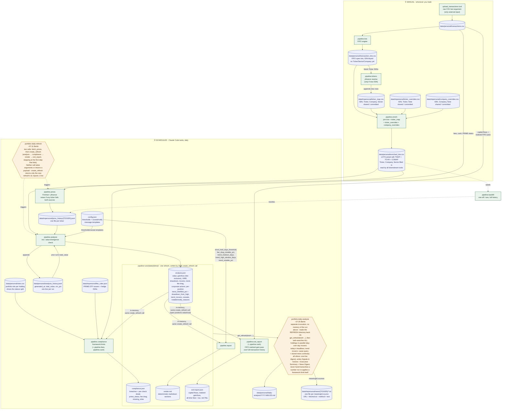

# Architecture

What this system is and how data moves through it. Not a rules/gotchas doc
(see [`AGENT_NOTES.md`](AGENT_NOTES.md) for that) and not a setup guide (see
[`SETUP.md`](SETUP.md)) - this is the objective "how it works" reference.

## Deployment model

This is **not** a project-scoped tool. `bootstrap.sh` (repo root, `make
bootstrap`) starts the server itself - deliberately Claude-free, it never
touches Claude Code's own config. `make claude-setup` is the separate,
independent step that registers the `portfolio` MCP server and the Claude
Skill **globally** (`claude mcp add --scope user`, plus copying
`skills/portfolio/` to `~/.claude/skills/portfolio/`) - the server is a
single long-running HTTP process (`portfolio_tools/server.py`,
`mcp.run(transport="streamable-http")`, bound to `127.0.0.1` only) that every
Claude Code session on the machine talks to, in every project, not just this
repo. There is no
`${CLAUDE_PROJECT_DIR}`-relative anything in this codebase - every path comes
from `portfolio_tools/paths.py`, never from cwd or "the current project."
**Concretely: if you're working in some unrelated project and the `portfolio`
MCP tools are available, they still operate on the same one portfolio's data**
- that is by design, not a bug.

**Code lives in the package; data does not.** `paths.py` resolves the data
root in this order: the `PORTFOLIO_DATA_DIR` environment variable, then
`PORTFOLIO_DATA_DIR=` in the package's `.env` (written by `setup-env.sh`, so
the value holds however the server is launched), then `<repo>/data/` as the
default. Data is external and relocatable so it can sit on a synced,
encrypted or separately-backed-up volume without any code change - and so
that the location is a deployment decision rather than something baked into
the source tree.

Inside the data root there are exactly two subdirectories, and which one a
file belongs in is what decides whether it can be committed:

| | Holds | Committed? |
|---|---|---|
| `personal/` | transactions, derived FIFO lots, analysis history, generated reports | No - all of it gitignored |
| `impersonal/` | `ticker_map.csv`, `ticker_overrides.csv`, `company_overrides.csv`, `price_history/`, `news/` | Yes - all of it committed |

The line is **ownership, not subject matter**: a market close for AMD is the
same number whoever looks it up, and so is a news article about it - but how
many shares you hold is not. Price history and news are therefore shared and
ever-growing, so resolving a ticker or fetching a day's close is work nobody
using this project has to repeat. That also makes the `.gitignore` rule
mechanical - one ignored directory, no per-file exceptions.

**Callers never see any of this.** Agents don't construct data paths, and
don't read or write data files directly - every read and write goes through
an MCP tool, including the news sources and the report, which the LLM
authors (`pipeline/storage.py`, exposed as `save_news_source`, `save_report`,
`get_report`, `list_reports`, `list_news`, `get_news_source`,
`read_ticker_map`, `set_ticker_mapping`). That is what makes the location
free to change: nothing outside the server depends on it.

Because it's one shared server reachable from potentially-concurrent
sessions/projects, `portfolio_tools/server.py` wraps **every** tool call in a
single `fcntl.flock`-based lock (`portfolio_tools/lock.py`, `data/.pipeline.lock`)
before it touches anything under `data/` - a single global lock beats
per-file locks here because several tools (e.g. `compute_lots`) touch more
than one file, and per-file locking would leave a gap between them.

There's no file-upload path assumed between whoever's talking to the server
and wherever the server is running (could be a different machine entirely,
in principle) - `transactions.csv` arrives via the `upload_transactions` tool
(raw CSV text as a string argument), not by the user placing a file at a
path. `portfolio_tools/pipeline/uploads.py` validates the header against the
expected Scalable Capital column set before saving (rejects garbage rather
than silently accepting a wrong-format paste), and keeps one `.bak` of
whatever was there before.

**The Claude Skill is intentionally not under `.claude/` in this repo** - it
lives at `skills/portfolio/` instead, so Claude Code doesn't auto-discover it
as a *project-scoped* skill while you're developing here. The skill is meant
to be reached only through its **global** install
(`~/.claude/skills/portfolio/`, deployed by `make claude-setup`), the same way any
other project would see it - keeping it out of `.claude/` avoids a second,
project-scoped copy silently coexisting with (and potentially drifting from)
the global one.

## Code layout

One package, no code outside it - `mcp_servers/portfolio_tools/`. The pipeline
is a subpackage of the server, not a sibling project:

```
skills/portfolio/           <- the Claude Skill source (see docs/AGENT_NOTES.md
                                for why it's not under .claude/); make
                                claude-setup copies it to ~/.claude/skills/portfolio/
docs/                        <- this directory: architecture, agent-dev rules,
                                human setup/quickstart guides
mcp_servers/
  portfolio_tools/             <- the whole distributable unit
    server.py                    FastMCP server, HTTP-only, the locking wrapper
    lock.py                      fcntl.flock-based cross-request/cross-process lock
    paths.py                     every path in one place: resolves the data root
                                (PORTFOLIO_DATA_DIR / .env / <repo>/data) and names
                                every file under it - no other module builds a path
    config.json, .env            config/secrets, not data
    pipeline/                    the deterministic computation
      lots.py, tickers.py, prices.py, backfill.py, analysis.py, report.py, config.py, uploads.py
      storage.py                 the agent-authored artifacts (news, reports) + ticker-map
                                 and role edits - the only way anything outside the server
                                 reads or writes data
      compliance.py              evaluates the portfolio against INVESTMENT_FRAMEWORK.md's
                                 hard limits and returns a structured `breaches` list, so the
                                 agent never re-applies an allocation rule in prose
      fees.py                    the broker's fee schedule as code (executed rows, prospective
                                 orders, PRIME status, aggregate + per-ticker fee drag)
      cash.py                    cash balance derived from the transaction ledger, for the
                                 cash-ceiling check
      exit_report.py             capital-flow + realized-gain pass over transactions.csv;
                                 answers "net P&L if I exit everything today" without
                                 touching any existing pipeline module
    requirements.txt, .venv/     one venv for the whole package (needs Python >=3.10) -
                                the ONLY interpreter ever used to run this code
data/                        <- DEFAULT data root, outside the package (relocatable
                                via PORTFOLIO_DATA_DIR - see "Deployment model")
  personal/                    transactions.csv, transaction_lots.csv, roles.csv,
                                analysis_history.jsonl, daily-analysis/          (not committed)
  impersonal/                  ticker_map.csv, ticker_overrides.csv, company_overrides.csv,
                                fee_rules.json, price_history/*.jsonl, news/     (committed)
bootstrap.sh                 <- repo root - base orchestrator: venv + server only,
                                deliberately Claude-free (delegates to scripts/)
setup-env.sh                 <- interactive prompt to write the Finnhub API key to .env
Makefile                     <- make bootstrap (venv+server) / make claude-setup
                                (mcp-register+skill-install, independent) / make
                                venv-setup / make server-start / make mcp-register /
                                make skill-install / make setup-env
scripts/
  venv-setup.sh              <- step 1 (make bootstrap): create .venv + install deps
  server-start.sh            <- step 2 (make bootstrap): start server in background
  mcp-register.sh            <- step 1 (make claude-setup): claude mcp add --scope user
  skill-install.sh           <- step 2 (make claude-setup): copy skills/portfolio/
                                to ~/.claude/skills/
```

Named `portfolio_tools`, not `mcp`, specifically so it never collides with the
third-party `mcp` SDK package this server imports
(`from mcp.server.fastmcp import FastMCP`) - a same-named local package would
shadow or be shadowed by that import depending on `sys.path` order. Don't
rename it back to `mcp`.

Every pipeline module still has its own `if __name__ == "__main__":` and can
be run directly (`portfolio_tools/.venv/bin/python3 -m
portfolio_tools.pipeline.<name>`, from inside `mcp_servers/` - always through
that venv's own interpreter, never a system Python) for local debugging - see
[`QUICKSTART.md`](QUICKSTART.md). The sanctioned interface is
the MCP tools over HTTP; don't design any new feature around direct module
invocation being the primary path.

## Data pipeline (in order)

See the diagram below for the same information visually. Every step is
exposed as an MCP tool - that's the sanctioned way to invoke it.

1. **`upload_transactions`** → **`data/personal/transactions.csv`** - the one
   file with no automated source. The complete raw CSV text (Scalable
   Capital's export format), always a full re-export, never incremental; the
   tool keeps one `.bak` of whatever was there before.
2. **`compute_lots`** → **`data/personal/transaction_lots.csv`** - FIFO cost-basis
   engine. Reconstructs exactly which shares are still held, when, and at
   what price, from the real transaction history (handles partial sells,
   ISIN-swap corporate actions, and broker-migration transfer rows). Output
   is ISIN-keyed only — no Ticker, Company or Sector yet; those come from
   the next steps.
3. **`data/impersonal/ticker_map.csv`** (ISIN, Ticker, Company, Sector) - the resolved
   ticker symbol and sector, the two things broker exports can't provide.
   Shared and committed - an ever-growing lookup table, because resolving a
   ticker correctly once means nobody using this project ever has to
   re-solve it. `resolve_tickers` deterministically resolves any new ISIN via
   a real yfinance lookup (never a guess) whenever `enrich_lots` reports one
   as unmapped; Sector still needs a quick human judgment call afterward.
   This file is never hand-edited to fix a wrong pick - see
   `data/impersonal/ticker_overrides.csv` below for that. Note the `Company`
   column here is *not* what reports display - that comes from the broker's
   own description in `transactions.csv` (see
   `data/impersonal/company_overrides.csv` below to correct a wrong one).
3a. **`data/impersonal/ticker_overrides.csv`** (ISIN, Ticker, Note) - explicit
    correction of a `resolve_tickers` pick, without ever rewriting
    `ticker_map.csv` in place. The typical case: the auto-picked listing
    trades in an unsupported currency (`resolve_tickers` flags this with a
    warning) and a cross-listed EUR/USD/GBP/DKK listing for the same company
    needs to be substituted instead. Set via `set_ticker_override`, never a guess -
    verify the substitute's currency and that it's the same company first,
    same as `resolve_tickers` itself would.
3b. **`enrich_lots`** → **`data/personal/enriched_lots.csv`** - joins
    `transaction_lots.csv` with `ticker_map.csv`, `ticker_overrides.csv` and
    `company_overrides.csv`. This is the file every downstream tool reads
    (prices, backfill, analysis, fees, storage). Run it after `compute_lots`,
    after `resolve_tickers`, or after `set_ticker_mapping` /
    `set_ticker_override`. Replaces the old pattern of running `compute_lots`
    a second time.
4. **`fetch_prices`** → **`data/impersonal/price_history/{TICKER}.jsonl`** - fetches the
   ticker list from `enriched_lots.csv`, gets live prices (Finnhub
   primary, yfinance fallback), and appends one fully-sourced record per
   ticker (original currency, source name/URL, FX rate + source) to its own
   history file. There is no separate latest-price snapshot file - each
   file's last line IS the current price. **Raises if any ticker fails on
   both sources** - tickers that DID resolve are still fetched and appended
   first, so a partial fetch isn't lost, but the call as a whole errors out
   (the caller is expected to stop and report it, not proceed to
   `create_refresh` on an incomplete price set).

   **Running it N times in a day appends N records for that day** - it is a
   plain append, with no same-day check. That is allowed and non-destructive
   (each record carries its own timestamp, source URL and FX rate), but it
   means the raw file is *not* a daily series. The analysis step (below)
   collapses each ticker to one record per calendar day on read (last write
   wins - see `_collapse_to_daily` in `pipeline/analysis.py`), so every
   downstream figure is day-over-day regardless of how many times prices
   were fetched. Note `backfill_history` writes exactly one record per day
   (`open(..., "w")`, it rewrites the file), so one-per-day is the file's
   intended grain and `fetch_prices` is the writer that departs from it - a
   backfill after a multi-fetch day will silently discard that day's extra
   records.
5. **`create_refresh`** → **`data/personal/pipeline-runs/{date}/{time}/`** -
   takes no arguments; runs four steps in order, each reading whatever it
   needs from the previous step's in-memory result (not from a file - all
   four run inside one tool call) and writing its own file into one new
   directory (a "refresh"):
   - **analysis** (`analysis.json`) - deterministic numeric layer: value,
     gain/loss, sector breakdown, high-water-mark/drawdown, movers, trend,
     and a real money-weighted XIRR (annualized return) from
     `enriched_lots.csv`'s actual purchase dates. Flags stale prices and a
     run-over-run value divergence (see "Notable incidents" in
     `AGENT_NOTES.md`). Also computes `underwater_positions` - positions
     down `underwater_notable_pct`+ on **total** return since purchase,
     independent of `trend_movers`' 56-day window (a whipsaw can net that
     window out to mild even when the position has been a bad investment
     the whole time - see "Notable incidents", 2026-07-28). Every threshold
     lives in `config.json` (see "Configurable thresholds" below). Also
     appends to `analysis_history.jsonl` as a side effect.
   - **compliance** (`compliance.json`) - evaluates the analysis step's
     output against every hard limit in the investment framework (sleeve
     split, single-position and hedge caps, top-3 and per-sector
     concentration, cash ceiling, sub-EUR 250 positions). A structured
     `breaches` list rather than prose, for the same reason the analysis
     step returns numbers: an agent restating a limit from memory against a
     hand-copied percentage is exactly how a wrong "within limits" gets
     published. Sleeve checks depend on `roles.csv`, so anything in
     `missing_roles` makes that check partial. Also returns `role_notes` -
     any position whose role assignment carries a human-authored note (e.g.
     flagging an instrument, like a leveraged/inverse daily-reset product,
     as structurally unsuited to the framework at all) - surfaced
     unconditionally so a note already sitting in `roles.csv` is never
     missed for lack of an agent thinking to call `read_roles` separately.
   - **render** (`render.md`) - renders the analysis step's numbers as
     every table/figure the daily report uses (including an "Underwater
     Positions" section when `underwater_positions` is non-empty), so the
     LLM writing the report never hand-transcribes a number out of the
     JSON - it only writes the Executive Summary and Movers/Trend
     Movers/Underwater Positions research prose.
   - **exit_report** (`exit-report.json`) - the full exit P&L: capital
     flows, realized FIFO gain, taxes, all-time fees, hypothetical exit
     value (see "On-demand" below for what this answers).

   **Stops at the first step that fails** and reports the error rather than
   attempting the rest - a mid-run failure leaves a refresh directory with
   fewer than four files, which `get_refresh`/`list_refreshes` treat as
   invalid (see "Refreshes" below). Returns only the refresh's id (its path
   relative to `pipeline-runs/`, e.g. `"2026-07-28/07-11-03-041233"`), never
   any of the four payloads - read them back with `get_refresh`.

### Refreshes

`create_refresh`'s output is a directory, not a value: every deterministic
step it runs writes its file into one new directory nested
`pipeline-runs/{YYYY-MM-DD}/{HH-MM-SS-ffffff}/`, and the tool call returns
only that directory's id. Two more tools read it back:

- **`list_refreshes(date)`** - every refresh id for one day (default
  today), each flagged `[valid]` (all four files present) or
  `[INCOMPLETE]` (a `create_refresh` call that stopped partway through -
  see above). Used to find a specific refresh to re-read, or to check
  whether *any* valid refresh exists yet for a day before deciding whether
  a report can be regenerated from it (see `portfolio-refresh` below) or
  needs a fresh `create_refresh` first.
- **`get_refresh(kind, refresh_id)`** - the content of one step's file:
  `kind` is `"analysis"` / `"compliance"` / `"render"` / `"exit_report"`,
  returned as JSON text (or markdown text for `"render"`). `refresh_id` is
  optional - omit it for the latest *valid* refresh across any day; an
  incomplete refresh is skipped automatically when resolving "latest",
  exactly the same way `fetch_prices` writing 9 records for one day doesn't
  break "the current price" (last valid one wins).

This exists because `portfolio-daily-refresh` and `portfolio-daily-analysis`
(see "Scheduled tasks" below) are separate scheduled invocations with no
shared conversation: `portfolio-daily-refresh` calls `fetch_prices` then
`create_refresh` - the entire deterministic pass, two tool calls - and
`portfolio-daily-analysis` only reads that refresh back via `get_refresh`
before doing news research and writing the report. Nothing computed by one
task is ever an argument passed to a tool called by the other - see
`pipeline/run_store.py` for the directory/id logic and
`skills/portfolio/references/tasks/*.md` for the task-level split.

Run order: `compute_lots` FIRST (ISIN-only lots; works with no `ticker_map.csv`),
THEN `resolve_tickers` if any ISINs are new (appends to `ticker_map.csv`, then
**automatically calls `enrich_lots`** so `enriched_lots.csv` is immediately
current). `set_ticker_mapping` and `set_ticker_override` also call `enrich_lots`
automatically after every write — so after correcting a flagged ticker,
substituting a currency-supported listing, or filling in a blank Sector,
`enriched_lots.csv` is updated without an extra step.

The only time `enrich_lots` needs to be called explicitly is immediately after
`compute_lots` on a steady-state day (no new ISINs, no mapping changes), to
ensure `enriched_lots.csv` reflects the current lot file.

### Diagram

Legend: cylinders = persisted data files, rectangles = deterministic
`pipeline/` modules (no LLM involvement), hexagons = scheduled tasks
(LLM-in-the-loop wrapper around a deterministic module). Dotted edges =
rare/one-off, not part of the regular cycle. This diagram covers the
deterministic pipeline and its task wrappers only - the analysis/advisory
layer (`skills/portfolio/references/INVESTMENT_FRAMEWORK.md`) applied on top
of `TASKANALYSIS`'s output isn't part of it, since it doesn't read or write
any pipeline file.



There's a third, on-demand-only task alongside the two above:
**`portfolio-refresh`** (`skills/portfolio/references/tasks/refresh.md`),
invoked from a chat request rather than the schedule, for a mid-day "rerun
the numbers" / "refresh the news" / "redo the whole report" without waiting
for the next scheduled cycle. It has two operations: a full refresh (same
two calls `portfolio-daily-refresh` makes - always atomic, never partial) and
a news/report regeneration that reuses an existing valid refresh for the
day via `list_refreshes` + `get_refresh`, falling back to a full refresh
first only if nothing valid exists yet for today.

`generate_exit_report` (the `pipeline.exit_report` step inside
`create_refresh`) remains reachable on demand too via `get_refresh(kind="exit_report")`
on any existing refresh - it just also runs as a standard step of every
`create_refresh` call now, rather than being computed separately.

**Keep this diagram in sync.** Any change to a module's inputs/outputs, the
run order, a data file, or a scheduled task must land alongside a matching
edit here in the same change - an out-of-date diagram is worse than no
diagram.

## Data files

| File | Holds | Produced by |
|---|---|---|
| `data/personal/transactions.csv` | Raw broker export - the only external input | `upload_transactions` tool (keeps one `.bak`) |
| `data/impersonal/ticker_map.csv` | ISIN, Ticker, Company, Sector - shared, committed. Never hand-edited to fix a wrong pick - see `ticker_overrides.csv` below | `resolve_tickers` (Ticker/Company) + `set_ticker_mapping` (Sector, corrections) |
| `data/impersonal/ticker_overrides.csv` | ISIN, Ticker, Note - shared, committed. Substitutes a different ticker for the handful of ISINs where `resolve_tickers`' pick trades in an unsupported currency; everything unlisted keeps `ticker_map.csv`'s pick | `set_ticker_override`; `pipeline/enrich.py` applies it |
| `data/impersonal/company_overrides.csv` | ISIN, Company, Note - shared, committed. Corrects the handful of broker descriptions that name the wrong company; everything unlisted keeps the broker's own label | You (hand-edited in the repo); `pipeline/enrich.py` applies it |
| `config.json` | All tunable thresholds and every caveat/notify-reason message template - shared, committed, not personal data | You (hand-edited); `pipeline/config.py` just loads it |
| `data/personal/transaction_lots.csv` | FIFO open lots, ISIN-keyed — no Ticker/Company/Sector. Only `pipeline/tickers.py` (to find blank-Ticker ISINs) and `pipeline/enrich.py` read this directly; everything else reads `enriched_lots.csv` | `compute_lots` |
| `data/personal/enriched_lots.csv` | FIFO lots joined with `ticker_map.csv`, `ticker_overrides.csv` and `company_overrides.csv` — Ticker, Company, Sector filled in. This is the file every downstream tool reads (prices, backfill, analysis, fees, storage) | `enrich_lots` |
| `data/impersonal/price_history/{TICKER}.jsonl` | Full sourced price history, one file per ticker. May hold several records for one day (one per `fetch_prices` run); readers collapse to one per day, last wins | `fetch_prices` (appends, no same-day check) / `backfill_history` (one-off, rewrites at one record per day) |
| `data/personal/analysis_history.jsonl` | One line per `analyze_portfolio` run: `generated_at`, `total_value`, `xirr_pct` - append-only, powers the value-divergence caveat | `analyze_portfolio` |
| `data/personal/roles.csv` | Portfolio role per holding (Core Compounder / Growth / Opportunistic / Defensive) + when last confirmed. Personal, not impersonal: a role describes how a position functions in *this* portfolio, so the same ETF is Growth for one holder and Defensive for another | `set_position_role` (read via `read_roles`) |
| `data/impersonal/fee_rules.json` | PRIME ETF issuer list + secure-hedge ISIN list - describes the broker's public fee structure and instrument categories, not anything personal | You (hand-edited in the repo); `pipeline/fees.py` and `pipeline/compliance.py` read it |
| `data/personal/daily-analysis/*.md` | Generated reports | `portfolio-daily-analysis` task |
| `data/impersonal/news/{TICKER}/*.txt` | One file per fetched news source deemed meaningful (metadata header + fetched text) | `portfolio-daily-analysis` task + any ad-hoc analysis that fetches news |
| `data/personal/pipeline-runs/{date}/{time}/analysis.json` | The analysis step's JSON, on disk instead of returned inline (see above) | `create_refresh` (read back via `get_refresh(kind="analysis")`) |
| `data/personal/pipeline-runs/{date}/{time}/compliance.json` | The compliance step's JSON | `create_refresh` (read back via `get_refresh(kind="compliance")`) |
| `data/personal/pipeline-runs/{date}/{time}/render.md` | The render step's markdown | `create_refresh` (read back via `get_refresh(kind="render")`) |
| `data/personal/pipeline-runs/{date}/{time}/exit-report.json` | The exit-report step's JSON | `create_refresh` (read back via `get_refresh(kind="exit_report")`) |

## MCP tools

All deterministic, zero LLM involvement in the computation itself, all
serialized through the global lock:

| Tool | Wraps | Uses | Produces | Run order |
|---|---|---|---|---|
| `upload_transactions` | `pipeline/uploads.py` | Raw CSV text (tool argument) | `data/personal/transactions.csv` (+ `.bak` of previous) | whenever the user has a new export |
| `compute_lots` | `pipeline/lots.py` | `data/personal/transactions.csv` | `data/personal/transaction_lots.csv` (ISIN-keyed, no Ticker/Sector/Company, incl. per-lot `Fee`) | 1st |
| `resolve_tickers` | `pipeline/tickers.py` | `data/personal/transaction_lots.csv` (checks unmapped ISINs against `ticker_map.csv`) + `yfinance` search/currency/history checks | Appends rows to `data/impersonal/ticker_map.csv` (Sector blank); **automatically calls `enrich_lots`** at the end | 2nd, only when a new ISIN appears |
| `enrich_lots` | `pipeline/enrich.py` | `data/personal/transaction_lots.csv` + `data/impersonal/ticker_map.csv` + `data/impersonal/ticker_overrides.csv` + `data/impersonal/company_overrides.csv` | `data/personal/enriched_lots.csv` (full join; Ticker, Company, Sector filled in) | after `compute_lots` (explicit); called automatically by `resolve_tickers`, `set_ticker_mapping` and `set_ticker_override` |
| `fetch_prices` | `pipeline/prices.py` | `data/personal/enriched_lots.csv` + Finnhub/yfinance | Appends to `data/impersonal/price_history/*.jsonl`; **raises if any ticker fails on both sources** (successfully-fetched tickers are still appended first) | daily, before `create_refresh` |
| `backfill_history` | `pipeline/backfill.py` | `data/personal/enriched_lots.csv` + yfinance historical | Rewrites `data/impersonal/price_history/*.jsonl` (full history) | one-off/rare |
| `create_refresh` | `pipeline/analysis.py` + `compliance.py` + `report.py` + `exit_report.py`, via `pipeline/run_store.py` | No arguments. Runs analysis → compliance → render → exit_report in order, each step reading the previous one's result in-memory (all within one tool call) | Writes all four files into one new `data/personal/pipeline-runs/{date}/{time}/` directory and returns only that directory's id - never any payload. **Stops at the first step that fails**, which can leave fewer than four files (see "Refreshes" above) | after `fetch_prices` |
| `list_refreshes` | `pipeline/run_store.py` | Optional `date` (YYYY-MM-DD, default today) | Refresh ids for that day, oldest first, each flagged `[valid]` or `[INCOMPLETE]` | whenever a caller needs to find or check a refresh |
| `get_refresh` | `pipeline/run_store.py` | `kind` (`"analysis"`/`"compliance"`/`"render"`/`"exit_report"`) + optional `refresh_id` | That step's content (JSON text, or markdown for `"render"`) from the given refresh, or the latest *valid* refresh overall if `refresh_id` is omitted | whenever a caller needs the payload `create_refresh` wrote |
| `save_news_source` | `pipeline/storage.py` | Ticker + source facts + fetched text (tool arguments) | One file under `data/impersonal/news/{TICKER}/`; server generates timestamp, slug, metadata header | during news research |
| `save_report` / `get_report` / `list_reports` | `pipeline/storage.py` | Report markdown (tool argument) / a date | `data/personal/daily-analysis/YYYY-MM-DD.md` (re-saving replaces) | end of the daily task |
| `list_news` / `get_news_source` | `pipeline/storage.py` | Ticker (+ filename) | Filenames / full stored text | when checking what's already captured |
| `read_ticker_map` / `set_ticker_mapping` | `pipeline/storage.py` | ISIN + any of Ticker/Company/Sector | Rewrites `data/impersonal/ticker_map.csv` in place; **`set_ticker_mapping` automatically calls `enrich_lots`** so `enriched_lots.csv` is immediately current | filling in a blank Sector, or correcting a mis-resolved listing |
| `read_ticker_overrides` / `set_ticker_override` | `pipeline/storage.py` | ISIN + Ticker (+ note) | Rewrites `data/impersonal/ticker_overrides.csv` in place, never `ticker_map.csv`; **`set_ticker_override` automatically calls `enrich_lots`** so `enriched_lots.csv` is immediately current | the auto-picked listing itself is wrong (most commonly an unsupported currency) and needs substituting, not just a blank Sector |
| `list_lots` | `pipeline/storage.py` | optional ticker | `data/personal/enriched_lots.csv` as text (all lots, or one ticker's) - read-only | auditing what a cost basis or holding period is built from |
| `read_roles` / `set_position_role` | `pipeline/storage.py` | Ticker + role (+ note) | Rewrites `data/personal/roles.csv`; roles drive the sleeve split, so a stale label quietly invalidates that check | when a position's thesis changes sleeve |

## Scheduled tasks

Thin LLM wrappers around the deterministic core:

| Task | Does | Deterministic or LLM? |
|---|---|---|
| `portfolio-daily-refresh` (~07:11 Berlin) | Two calls: `fetch_prices`, then `create_refresh` (analysis → compliance → render → exit_report, stopping at the first step that fails). Neither takes arguments or returns a payload - `create_refresh` returns only the new refresh's id. Reports one summary line | Entirely deterministic - LLM just calls the two tools in order and reports |
| `portfolio-daily-analysis` (~07:25 Berlin) | Separate invocation with no memory of the run above - reads that refresh back with `get_refresh(kind=...)`, WebSearches all holdings in one parallel batch — day-over-day movers (today's headlines), trend movers (cause-oriented query + stored-news continuity via `list_news`/`get_news_source`), all others (one-line digest) — writes Signals & Actions + Executive Summary + News Digest | Hybrid - every number/table comes untouched from what `portfolio-daily-refresh` already wrote; LLM only adds the Executive Summary and news-research prose, never hand-transcribes a figure |

There's a third, on-demand-only task alongside the two schedule-triggered
ones above: **`portfolio-refresh`** (`skills/portfolio/references/tasks/refresh.md`),
invoked from a chat request rather than a cron schedule, for a mid-day
"rerun the numbers" / "refresh the news" / "redo the whole report" without
waiting for the next scheduled cycle. Two operations: a full refresh (the
same two calls `portfolio-daily-refresh` makes - always atomic, never
partial) and a news/report regeneration that reuses an existing valid
refresh for the day (`list_refreshes` + `get_refresh`), falling back to a
full refresh first only if nothing valid exists yet for today.

All three tasks' real instructions live in the skill bundle at
`skills/portfolio/references/tasks/*.md` (each scheduled task's own prompt is
just a one-line pointer into the globally-deployed copy of that file, not the
instructions themselves) - see [`AGENT_NOTES.md`](AGENT_NOTES.md) for how to
change task behavior.

## Currency handling

Supported: **EUR** (no conversion), **USD**, **GBP**, **GBp** (British pence -
divided by 100 to GBP before applying the EUR/GBP rate), **DKK**. Anything
else is rejected (returns `None`/skipped), not silently mispriced. `price_eur`
is the one field every downstream module reads; never read
`price_original_currency` for computation, only for display/audit.

`pipeline/prices.py` (live) and `pipeline/backfill.py` (historical) each
implement this independently but must stay in sync - if you add a currency to
one, add it to the other. Historical FX rates are used for backfill (not
today's rate applied retroactively) - each FX pair's series only goes back so
far (e.g. EUR/USD and EUR/DKK data both start 2003-12-01 - a Yahoo Finance
data-availability limit, not tied to either currency's actual origin), so
older ticker history is truncated rather than priced with a fabricated rate.

DKK was added deliberately as permanent support (same reasoning as GBp before
it - see `AGENT_NOTES.md`'s "A currency-conversion near-miss"), not as a
one-off workaround: it's pegged tightly to EUR under ERM II (~7.46 DKK/EUR,
±2.25% band), so the FX risk it introduces is minimal, and Copenhagen-listed
securities (e.g. Novo Nordisk's primary listing, `NOVO-B.CO`) are common
enough to be worth a real listing rather than routing everyone to a
secondary ADR.

## FIFO / transaction parsing rules (`pipeline/lots.py`)

- Transactions are sorted by full **date+time**, not date alone - the broker
  export lists transactions newest-first, so same-day trades need the
  timestamp to sequence correctly (see `AGENT_NOTES.md`'s "Notable
  incidents" for the bug this fixed).
- `"Security transfer"` transaction rows are a broker/account migration
  artifact (e.g. this project's Dec 2025 Scalable Capital migration: a
  same-ISIN withdrawal immediately followed by a deposit of the identical
  quantity). These net to exactly zero per ISIN and are excluded entirely so
  original purchase dates survive the migration instead of resetting.
- `"Corporate action"` rows can represent a reverse split/ISIN change (e.g.
  this project's WisdomTree Brent Crude Oil 3x Daily Short ISIN swap).
  Handled by carrying the old ISIN's total cost basis and weighted-average
  purchase date onto the new ISIN - it's a continuation, not a disposal + new
  purchase.

## Historical price data quality

`pipeline/analysis.py` drops historical price points that are more than 100x
away from a ticker's current price (`SPLIT_ADJUSTMENT_SANITY_RATIO`). This
guards against `yfinance`'s historical data for some thinly-traded/leveraged
ETPs not being retroactively adjusted for later reverse splits (see
`AGENT_NOTES.md`'s "Notable incidents"). 100x is deliberately generous so it
never triggers on ordinary volatility.

**Known performance issue (unrelated to the HTTP/locking design, not yet
fixed):** `compute_portfolio_value_series`/`price_at_or_before` in
`pipeline/analysis.py` does a linear scan per (date × position) pair to build
the full-history value series that drawdown/trend use -
O(dates × positions × history length). Worth optimizing (e.g. binary search
instead of linear scan, since each ticker's history is already sorted) if it
becomes a real problem.

## Trend vs. drawdown: two different, deliberately different methodologies

- **`drawdown`/high-water-mark** uses the FULL available price history for
  every ticker, multiplied by TODAY's share count - a synthetic "what if I'd
  held this exact portfolio further back" calculation. It answers "what's the
  worst-case value swing of my current holdings," not a claim about the
  portfolio's real historical value.
- **`trend.since_inception`** is anchored to the EARLIEST actual purchase
  date in `data/personal/transaction_lots.csv`, NOT the earliest available
  price-history point - using full history here produced a confirmed bug
  (see `AGENT_NOTES.md`'s "Notable incidents"). Don't "fix" this back to
  using full history; the discrepancy between these two methodologies is the
  point, not an inconsistency to resolve.

## Annualized return (XIRR)

`annualized_returns` is a real money-weighted XIRR computed from
`data/personal/transaction_lots.csv`'s actual purchase dates/prices - not
`total_return / years_held`. Check `weighted_avg_holding_days` before
treating any single position's XIRR as meaningful: annualizing a short real
holding period produces mathematically extreme numbers (e.g. a genuine 37%
gain over 12 weeks annualizes to 300%+). That's correct math, not a bug. No
position needs to have been held a full year for the *portfolio-wide* XIRR to
be meaningful.

## Notification signal (`notable`/`notify_reasons`)

Whether the daily task sends a push notification is a fixed rule evaluated by
`analyze_portfolio`, not a judgment call made fresh each run. `notable` is
`true` if any of: a mover's `|change_pct|` is >= `config.json`'s
`thresholds.mover_notable_pct` (5% by default, percentage move, not EUR
size), `stale_prices` is non-empty, the value-divergence check fired, any
`trend_movers` entry's `drawdown_from_high_pct` is <= `-thresholds.drawdown_notable_pct`
(30% by default — fires regardless of whether anything moved today, so a
position that has been sliding for weeks without a single big daily session
will still trigger), or `underwater_positions` is non-empty (any position
down `thresholds.underwater_notable_pct`+ on total return since purchase -
deliberately independent of the `trend_movers` 56-day window above, so a
position whose medium-window return whipsawed back to looking mild still
triggers this if its overall return is still bad; see "Notable incidents",
2026-07-28). `notify_reasons` lists which, rendered from `config.json`'s
`notify_reasons` templates.

## Configurable thresholds and caveats (`config.json`)

Every numeric threshold and every caveat/notify-reason message string used by
`pipeline/analysis.py` and `pipeline/report.py` lives in `config.json`, not
hardcoded in the modules - `stale_price_max_age_days`, `mover_notable_pct`,
`value_divergence_pct`, `split_adjustment_sanity_ratio`,
`full_year_holding_days`, `short_hold_days_threshold`, `movers_top_n`,
`largest_positions_top_n`, `trend_short_days`, `trend_medium_days`,
`trend_high_window_days`, `trend_notable_pct`, `trend_movers_top_n`,
`drawdown_notable_pct`, `underwater_notable_pct`,
`underwater_positions_top_n` under `thresholds`; the boilerplate methodology
notes plus the templated tickers-without-lot-data/stale-prices/short-holding/
value-divergence messages under `caveats`; the five notification message
templates under `notify_reasons`. To change a number or wording, edit
`config.json` directly - no code change needed, and it takes effect on the
next call to either tool (the server reads the file fresh every call - no
caching to invalidate).

`pipeline/config.py` is a thin shared loader (`load_config()`), imported by
both `analysis.py` and `report.py` - it does NOT duplicate `config.json`'s
values as Python defaults, so there's exactly one place thresholds live. A
missing or invalid `config.json` is therefore a hard error (`SystemExit` with
a clear message), not a silent fallback. `config.json` is committed
(shared/non-personal, like `data/impersonal/ticker_map.csv`), so "missing" should only
happen from local file damage, never a fresh clone.

Message templates use Python `str.format()` placeholders (e.g. `{tickers}`,
`{max_age_days}`, `{change_pct:+.1f}`) - if you edit a template's wording,
keep its placeholder names intact or the corresponding `.format(...)` call in
`analyze_portfolio`'s `main()` will raise a `KeyError`.

## Data provenance / secrets

Every `data/impersonal/price_history/{TICKER}.jsonl` record for a non-EUR ticker carries
its original currency, raw price, exact source URL (API token redacted
before persisting), and the FX rate + source used. EUR-native records omit
all of this (would just be no-op restatements). Never persist an API
token/secret into any output file, ever.
