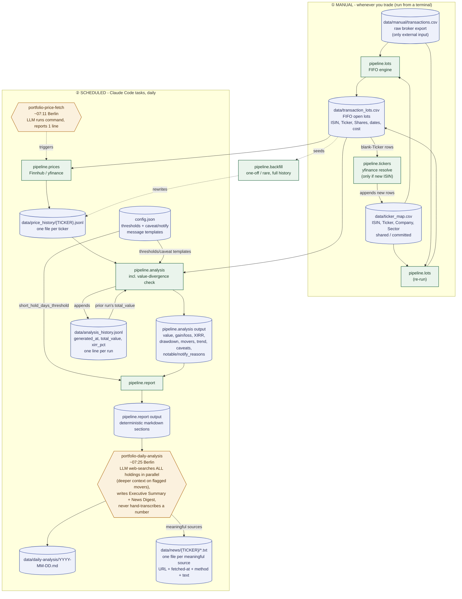

# Pipeline diagram

Visual companion to `AGENT_NOTES.md`'s file map and `README.md`'s "Data
pipeline" section - same information, diagram form. If this ever disagrees
with either of those, trust the prose docs and fix this diagram (see the rule
in `AGENT_NOTES.md` about keeping it in sync).

This diagram covers the deterministic pipeline and its task wrappers only.
The analysis/advisory layer applied on top of `TASKANALYSIS`'s output (or in
ad-hoc chat) is `INVESTMENT_FRAMEWORK.md` - not part of this diagram since it
doesn't read or write any pipeline file.

**Legend:** cylinders = persisted data files, rectangles = deterministic
`pipeline/` modules (no LLM involvement), hexagons = scheduled tasks
(LLM-in-the-loop wrapper around a deterministic module). Dotted edges =
rare/one-off, not part of the regular cycle.

Every rectangle below is a `python3 -m pipeline.<name>`-runnable module (see
`QUICKSTART.md`) and can also be invoked as a typed MCP tool via
`mcp/server.py` (same function, same output, no separate implementation) -
that's the invocation path the `portfolio` skill and scheduled tasks use.
See `AGENT_NOTES.md`'s pipeline components table for the tool-name mapping.
This diagram covers data flow, which doesn't change based on invocation
transport, so it isn't redrawn for this.

All data-file paths below are relative to `portfolio/data/`, except
`transactions.csv` which lives in `data/manual/` specifically (the one file
with no automated source) and `config.json` which stays at the `portfolio/`
root, not under `pipeline/`.

