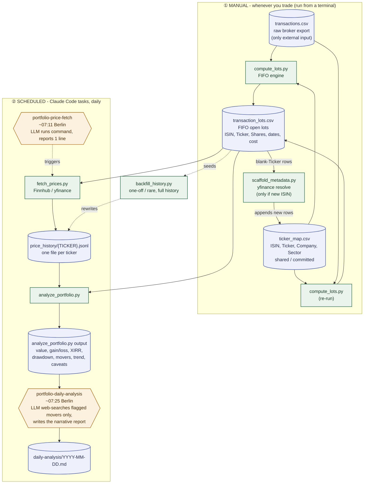

# Pipeline diagram

Visual companion to `AGENT_NOTES.md`'s file map and `README.md`'s "Data
pipeline" section - same information, diagram form. If this ever disagrees
with either of those, trust the prose docs and fix this diagram (see the rule
in `AGENT_NOTES.md` about keeping it in sync).

**Legend:** cylinders = persisted data files, rectangles = deterministic
scripts (no LLM involvement), hexagons = scheduled tasks (LLM-in-the-loop
wrapper around a deterministic script). Dotted edges = rare/one-off, not part
of the regular cycle.

